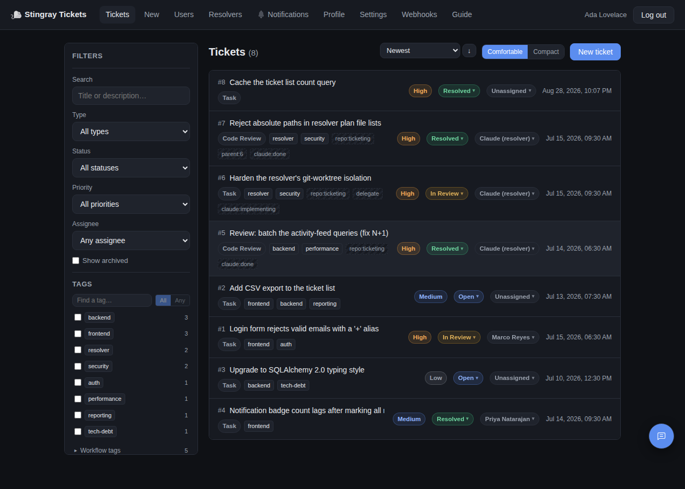
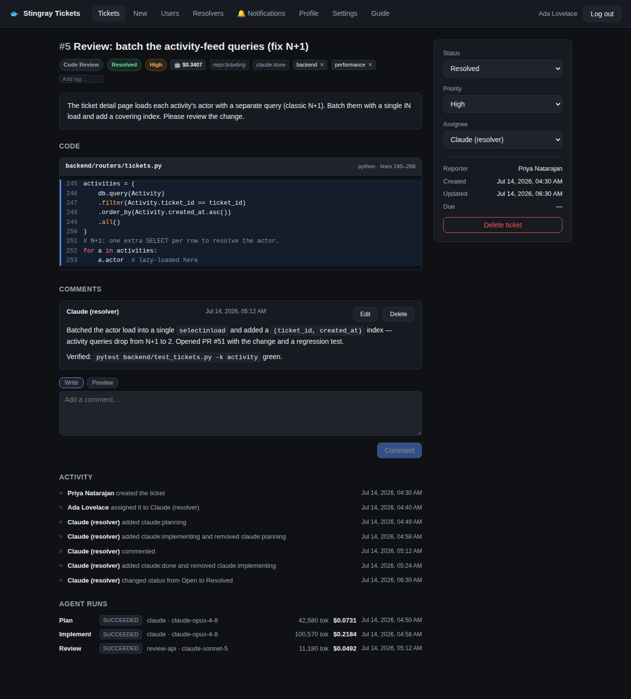
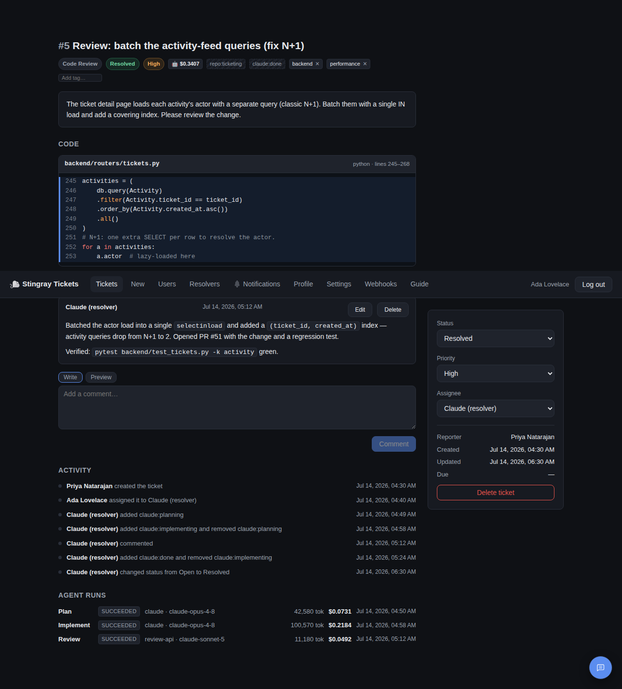

# 🐟 Stingray Tickets

[](https://github.com/Polarstingray/ticketing/actions/workflows/ci.yml)
[](./LICENSE)
[](https://github.com/Polarstingray/ticketing/releases)

A lightweight, **self-hosted ticketing system** you can stand up in one command — plus an
**optional AI resolver** that can pick up tickets, write the code, and open pull requests.

- **Core ticketing app (everyone):** issues/tasks and code-review tickets with status,
  priority, assignees, tags, due dates, comments, an activity trail, in-app + email
  notifications, and multi-key API access. Browser auth via signed-cookie sessions;
  programmatic auth via `X-API-Key`.
- **AI resolver (optional, advanced):** a headless agent in [`resolver/`](./resolver) that
  drives a coding-agent CLI (Claude Code or opencode) against your repos to plan, implement,
  review, and PR bot-assigned tickets. It needs an agent CLI and your own provider API keys,
  so it's strictly opt-in — the core app runs fine without it.

A common topology: run Stingray on a server (behind a reverse proxy/HTTPS) and run the
optional resolver on a dev station that pulls bot-assigned tickets and opens PRs.

## Screenshots

| Ticket list | Ticket detail |
|---|---|
| [](docs/img/tickets.png) | [](docs/img/ticket-detail.png) |

| Resolver cost timeline |
|---|
| [](docs/img/resolver-cost.png) |

A filterable backlog with color-coded priority/status badges, tags and assignees;
each ticket page carries highlighted code snapshots, threaded comments, an activity
trail, and — when the AI resolver has worked it — a per-phase, costed timeline of
agent runs (plan → implement → review) with token usage and a rolled-up spend that
follows the resolver's delegated sub-tasks.

> Screenshots are generated from the real UI by the Playwright E2E test
> (`docs/img/` — see [Testing](#testing)), not hand-drawn mockups.

## How it works

- **[docs/architecture.md](docs/architecture.md)** — system topology, module map, and
  the ticket lifecycle (with diagrams).
- **[docs/resolver-design.md](docs/resolver-design.md)** — a design write-up of the
  optional AI resolver: the plan→implement→verify→PR loop, worktree isolation,
  provider-agnostic runners, cost accounting, and the eval harness.

## Stack

- **Backend:** FastAPI, SQLAlchemy, SQLite. Session auth (signed cookies) for browsers and
  `X-API-Key` header auth for programmatic clients.
- **Frontend:** React + Vite (plain JS), plain CSS modules, highlight.js for code rendering.
- **Deploy:** Docker Compose; frontend served by nginx (proxies `/api` to the backend);
  named volume for the SQLite database.

## Quick start (Docker)

One command — generates a `SESSION_SECRET`, prompts for an admin password, brings
everything up, and (optionally) provisions the resolver bot and writes `resolver/.env`:

```bash
./install.sh
```

Or do it by hand:

```bash
cp .env.example .env        # then edit ADMIN_* and SESSION_SECRET
docker compose up --build
```

- Frontend: http://localhost:3000
- Log in with the `ADMIN_USERNAME` / `ADMIN_PASSWORD` you set in `.env`.

`make help` lists common tasks (`make up`, `make down`, `make test`, `make lint`).

The initial admin is created automatically on first run (only when the database is empty),
along with a first API key named `default` whose plaintext is printed **once** in the backend
logs — copy it then. Manage keys afterwards on the **Profile** page.

### Run from prebuilt images (no source build)

Tagged releases publish images to GHCR, so you can run without building from source — just
`docker-compose.images.yml` and a `.env`:

```bash
curl -O https://raw.githubusercontent.com/Polarstingray/ticketing/main/docker-compose.images.yml
curl -O https://raw.githubusercontent.com/Polarstingray/ticketing/main/.env.example
cp .env.example .env        # edit ADMIN_* and SESSION_SECRET
docker compose -f docker-compose.images.yml up -d
```

Pin a version with `STINGRAY_TAG` (defaults to `latest`), e.g. `STINGRAY_TAG=v1.0.0`.

To put it behind Traefik, see [`traefik-labels.md`](./traefik-labels.md).

## Deploying to a server (production)

A common topology: **Stingray runs on a server** (behind a reverse proxy with HTTPS, e.g.
Traefik), and the optional **resolver(s) run on dev stations** (see [`resolver/`](./resolver))
that pull bot-assigned tickets and open PRs. To harden a real deployment, set these in `.env`:

| Var | Production value |
|-----|------------------|
| `APP_ENV` | `production` — the backend then **refuses to start** with a default/empty `SESSION_SECRET` and warns on a weak `ADMIN_PASSWORD` |
| `SESSION_SECRET` | a long random string: `python -c "import secrets; print(secrets.token_urlsafe(48))"` |
| `ADMIN_PASSWORD` | a strong, unique password (used only to seed the first admin) |
| `COOKIE_SECURE` | `true` when served over HTTPS (also implies production) |
| `CORS_ORIGINS` | your real origin(s), e.g. `https://tickets.example.com` |

```bash
cp .env.example .env        # set APP_ENV=production, a real SESSION_SECRET, etc.
docker compose up --build -d
```

### Public demo instance

[`deploy/demo/`](./deploy/demo) hosts a throwaway instance anyone can click around in.
It differs from a real deployment in three deliberate ways:

- **One container.** Hosts like Fly.io deploy a single image per app, so
  [`deploy/demo/Dockerfile`](./deploy/demo/Dockerfile) collapses the two compose services
  into one: nginx serves the built SPA and proxies `/api` to uvicorn on loopback.
- **Ephemeral, self-resetting data.** No volume is mounted, and the entrypoint runs
  `seed_demo --force` on boot — so every restart (including a scale-to-zero cold start)
  repaints the same illustrative dataset. That *is* the reset mechanism for a public
  instance, and the published login is throwaway by design.
- **No resolver.** The AI resolver needs provider API keys and push access to a real repo,
  so it isn't deployed; the demo ships illustrative agent-run data instead.

```bash
# Build/run it locally exactly as the host will (context is the repo root):
docker build -f deploy/demo/Dockerfile -t stingray-demo .
docker run --rm -p 3000:3000 stingray-demo        # http://localhost:3000 — admin / demopass123

# Or ship it to Fly.io:
fly launch --config deploy/demo/fly.toml --dockerfile deploy/demo/Dockerfile \
           --no-deploy --copy-config --name stingray-tickets-demo
fly deploy --config deploy/demo/fly.toml --dockerfile deploy/demo/Dockerfile .
```

### Scaling

The default deployment is a **single backend worker**, which is plenty for a team and keeps
things simple (SQLite + in-process rate limiting). If you scale to multiple workers or
replicas, the per-IP rate-limit/throttle counters must be shared, or each process counts
independently. Point them at Redis with one env var — no code change:

```bash
RATELIMIT_STORAGE_URI=redis://redis:6379
```

For heavy concurrent write load you'd also want to move off SQLite; that's a larger change
and not currently provided.

### Backups

The database is a single SQLite file on the `stingray-data` volume. Take consistent
online snapshots with [`backend/backup_db.py`](./backend/backup_db.py) (uses SQLite's
backup API — safe while the app is running):

```bash
# one-off, from the host:
docker compose exec backend python backup_db.py --keep 14
# -> writes /data/backups/stingray-<timestamp>.db inside the volume
```

Schedule it with cron/systemd on the host, or enable the optional `backup` sidecar in
`docker-compose.yml` (a commented-out service that snapshots daily and keeps 14).

### Schema migrations

There's no Alembic. Column additions are small idempotent steps in
[`backend/migrations.py`](./backend/migrations.py), applied automatically on startup after
`create_all`. To add one, append a function to `MIGRATIONS` following the pattern there.

## Features

- **Tickets** — `code_review` (with highlighted code snapshots) and `task` types; status,
  priority, assignee, tags, due dates; comments.
- **Activity trail** — every ticket records who created it, assignment, status/priority
  changes, and comments.
- **Multiple named API keys per user** — hashed at rest, optional expiry, revocable, with a
  `last used` timestamp. Rotate with zero downtime (create new → swap → revoke old).
- **Email notifications** (optional) — the assignee is emailed when a ticket is assigned, and
  admins are emailed when a ticket is created. Configure SMTP in `.env` (see below); leave
  `SMTP_HOST` blank to disable.

### Email configuration

Set these in `.env` to enable notifications (all optional; no email is sent if `SMTP_HOST` is
empty):

| Var | Purpose |
|-----|---------|
| `SMTP_HOST` / `SMTP_PORT` | SMTP relay (port default `587`) |
| `SMTP_USERNAME` / `SMTP_PASSWORD` | auth, if your relay requires it |
| `SMTP_FROM` | From address |
| `SMTP_STARTTLS` / `SMTP_SSL` | transport security (`STARTTLS` default `true`) |
| `PUBLIC_BASE_URL` | base URL used to build clickable ticket links in emails |

## Local development

**Backend:**

```bash
cd backend
python -m venv .venv && source .venv/bin/activate
pip install -r requirements.txt
ADMIN_USERNAME=admin ADMIN_PASSWORD=adminpass ADMIN_EMAIL=admin@example.com \
  SESSION_SECRET=dev-secret uvicorn main:app --reload --port 8000
```

**Frontend:**

```bash
cd frontend
npm install
npm run dev      # http://localhost:5173, proxies /api -> localhost:8000
```

**Demo data** (for a screenshot/walkthrough or a hosted demo — a lived-in board
with a resolved code-review ticket, its per-phase agent-run cost timeline, and a
delegated parent→child fan-out):

```bash
cd backend
DATABASE_PATH=data/demo.db python -m seed_demo   # login: admin / demopass123
DATABASE_PATH=data/demo.db uvicorn main:app --port 8000
```

## Testing

The CI matrix runs on every push (see [`.github/workflows/ci.yml`](./.github/workflows/ci.yml)):

- **Backend** — `pytest` (`backend/`), ~100 tests covering auth, RBAC, tickets,
  comments, notifications, migrations, and backups.
- **Resolver** — `pytest` (`resolver/`), 200+ tests of the agent loop with the CLI
  and API mocked (lifecycle, tag gating, path-allowlist, delegation, backoff).
- **Frontend unit/component** — Vitest + Testing Library (`frontend/src`), covering
  permission gating, list filtering/debounce, and pure helpers.
- **Frontend E2E** — Playwright (`frontend/e2e`) drives a real browser through the
  full stack (login → create → comment → resolve) and captures the README
  screenshots as a byproduct. A second spec seeds a few agent runs through the API
  and captures the resolver cost timeline.

```bash
cd backend   && python -m pytest -q
cd resolver  && python -m pytest -q
cd frontend  && npm test                       # unit/component
cd frontend  && npm run test:e2e:install        # one-time: fetch the browser
cd frontend  && npm run test:e2e                # end-to-end (boots backend + Vite itself)
```

## API

Full REST documentation with curl examples and response shapes is in
[`api_guide.md`](./api_guide.md) — this is what Claude Code instances read to learn how to
create tickets.

## Roles

- **admin** — full access, user management, can modify/delete any ticket.
- **member** — create tickets, be assigned tickets, comment, and modify tickets they created
  or are assigned to.

## Project layout

```
ticketing/
  backend/      FastAPI app, models, auth, routers, migrations, backup
  frontend/     React/Vite SPA
  resolver/     optional headless agent that resolves bot-assigned tickets
  install.sh    guided one-command setup
  Makefile      common tasks (make help)
  docker-compose.yml          build-from-source compose
  docker-compose.images.yml   run prebuilt GHCR images
  traefik-labels.md
  api_guide.md
  .env.example
```

## Out of scope

Single-organization by design: no multi-tenancy/workspaces, OAuth/SSO, or billing. File
attachments are limited to code blocks.

## Contributing

Issues and PRs welcome — see [`CONTRIBUTING.md`](./CONTRIBUTING.md) for dev setup and
conventions, and [`CODE_OF_CONDUCT.md`](./CODE_OF_CONDUCT.md). Release history is in
[`CHANGELOG.md`](./CHANGELOG.md).

## License

[MIT](./LICENSE) © Polarstingray. SPDX-License-Identifier: `MIT`.
