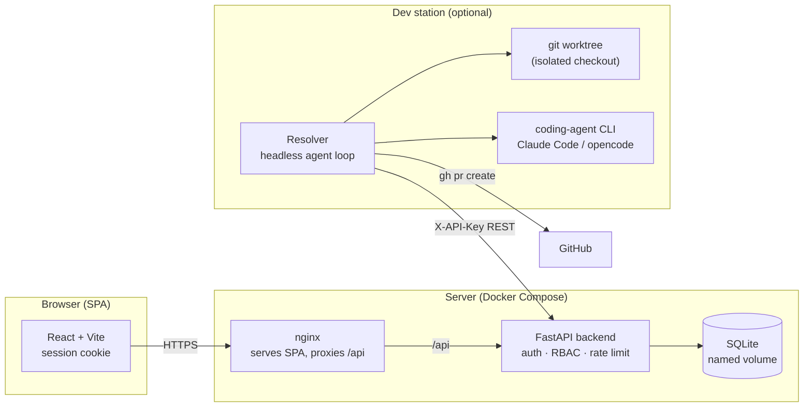
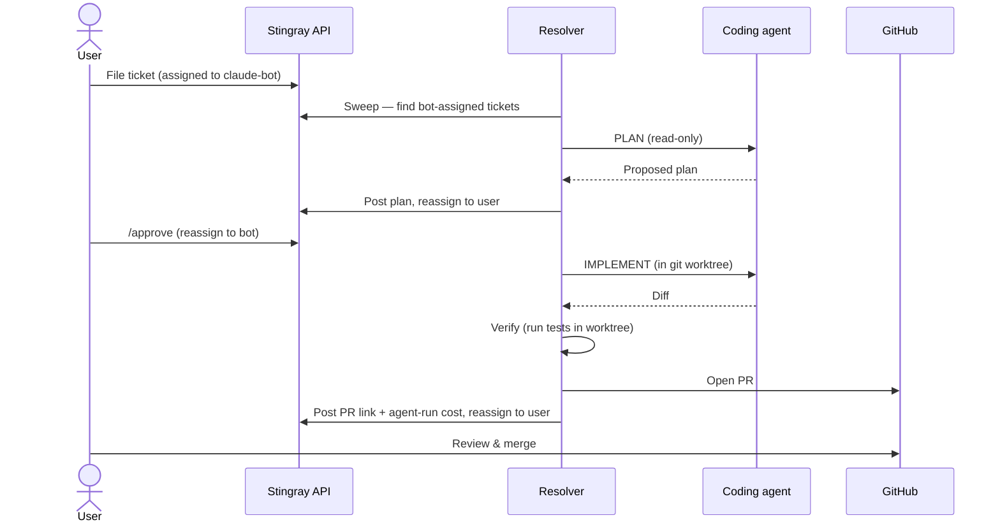

# Architecture

Stingray is two cleanly separated pieces that talk only over the REST API:

1. **The ticketing app** — a FastAPI backend + a React SPA. This is the whole
   product for most users.
2. **The optional AI resolver** — a headless agent that runs on a dev station,
   pulls bot-assigned tickets over the same public API, and opens pull requests.
   It has **no privileged backdoor**: it authenticates with an ordinary API key
   and is constrained by the same authorization rules as any other client.

## System topology

Two auth paths into the same API:

- **Browsers** use signed-cookie sessions (`session_version` embedded in the
  token lets a password/role change invalidate every outstanding cookie).
- **Programmatic clients** (the resolver, `curl`, CI) send an `X-API-Key`
  header. Keys are hashed at rest, named, individually revocable, and can expire.

## Backend module map

| Module | Responsibility |
|--------|----------------|
| `main.py` | App assembly, CORS, rate-limit handler, lifespan (migrate + seed) |
| `models.py` | SQLAlchemy ORM: users, API keys, tickets, comments, activity, notifications, agent runs |
| `auth.py` | Password hashing, session tokens, `X-API-Key` verification |
| `routers/` | Endpoint groups: `tickets`, `comments`, `users`, `auth`, `notifications`, `preferences` |
| `migrations.py` | Idempotent, additive column migrations applied on startup (no Alembic) |
| `startup.py` | Fail-fast secret checks — refuses to boot on a default `SESSION_SECRET` in production |
| `activity.py` / `inbox.py` | Audit-trail writes and the notification gate (`should_notify`) |
| `ratelimit.py` / `login_throttle.py` | Per-IP limits; pluggable Redis storage for multi-worker deploys |
| `seed.py` | First-admin bootstrap and optional resolver-bot provisioning |
| `chat/` | The optional in-app AI assistant: provider, context pack, prompt |

## Ticket lifecycle with the resolver

Every phase the resolver runs is recorded back on the ticket as an **agent run**
(model, token usage, and USD cost), so the otherwise-invisible automation shows
up as an auditable, costed timeline in the UI. See
[`resolver-design.md`](./resolver-design.md) for the internals.

## Deployment

- **Dev:** Vite dev server (`:5173`) proxies `/api` to a locally-run backend
  (`:8000`).
- **Prod:** `docker compose up` builds two images — nginx-served SPA and the
  FastAPI backend — with the SQLite database on a named volume. Tagged releases
  also publish images to GHCR (`docker-compose.images.yml`) so you can run
  without building from source.
